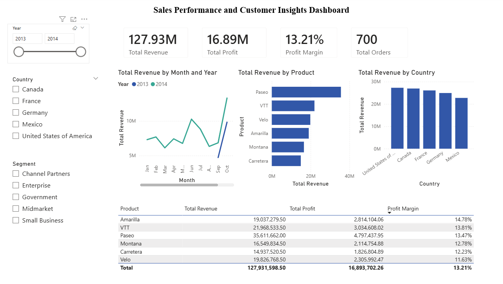

# Sales Performance & Customer Insights Dashboard

## Project Overview
An interactive Power BI dashboard that analyzes sales performance, customer behaviors and product trends with DAX-driven KPIs.

## Tools & Technologies
- **Power BI Desktop**
- **DAX (Data Analysis Expressions)**
- **Data Modeling**

## Dataset
- **Source:** Microsoft Financial Sample Dataset (Excel file)
- **Records:** 700 transactions
- **Time Period:** 2013-2014
- **Dimensions:** Products, Countries, Segments, Dates

## Key Features

### DAX Measures
- **Total Revenue:** `SUM(Financials[Sales])`
- **Total Profit:** `SUM(Financials[Profit])`
- **Profit Margin:** `DIVIDE([Total Profit], [Total Revenue])`
- **Total Orders:** `COUNTROWS(Financials)`
- **Revenue YTD:** `TOTALYTD([Total Revenue], DateTable[Date])`

### Visualizations
- **KPI Cards:** Real-time metrics for revenue, profit, margin, and order volume
- **Line Chart:** Revenue trends over time with year-over-year comparison
- **Bar Chart:** Top 10 products by revenue
- **Column Chart:** Regional performance analysis
- **Data Table:** Detailed product performance metrics
- **Interactive Slicers:** Year, Country, and Segment filters

## Dashboard Components
- **4 KPI Cards** displaying critical metrics
- **4 Interactive Charts** for trend and comparison analysis
- **1 Detailed Table** for granular insights
- **3 Slicers** for dynamic filtering

## How to Use
1. Download the `.pbix` file from this repository
2. Open with Power BI Desktop
3. Interact with slicers on the left to filter data by year, country, or segment
4. Hover over charts for detailed tooltips

## Future Enhancements
- Add forecasting for revenue predictions
- Add a second page with drill-through to show a certain product's performance
- Add more complex DAX with running totals, year-over-year growth in % and top N dynamic filtering

## Author
**Najlaa Achouhal**  
Bioinformatics student 
